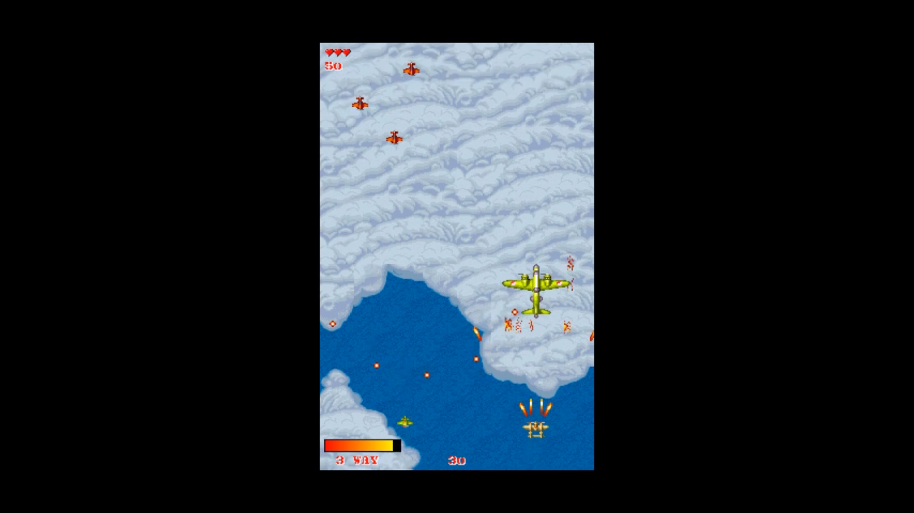
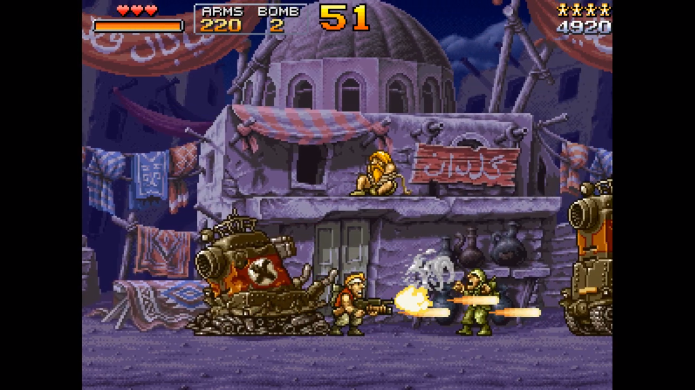
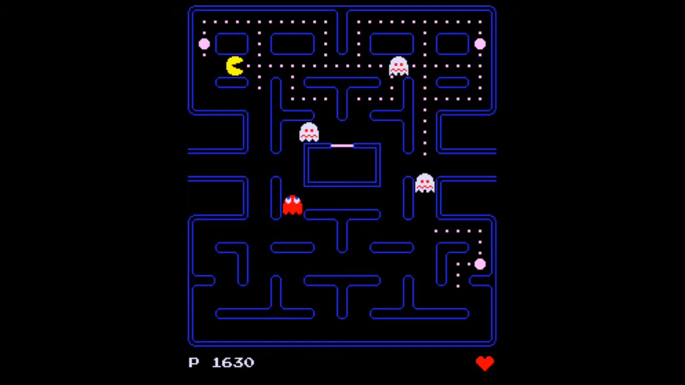
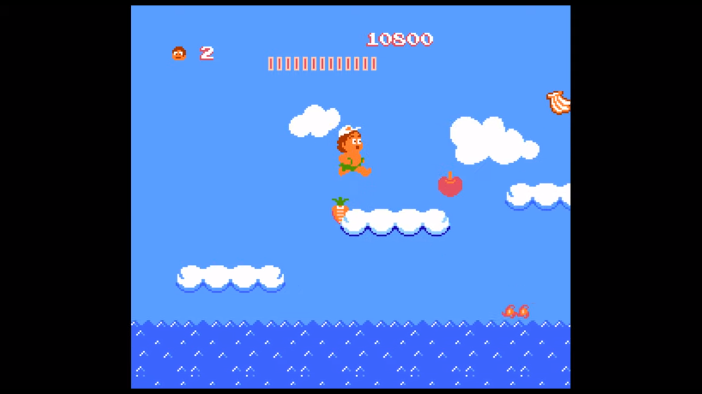
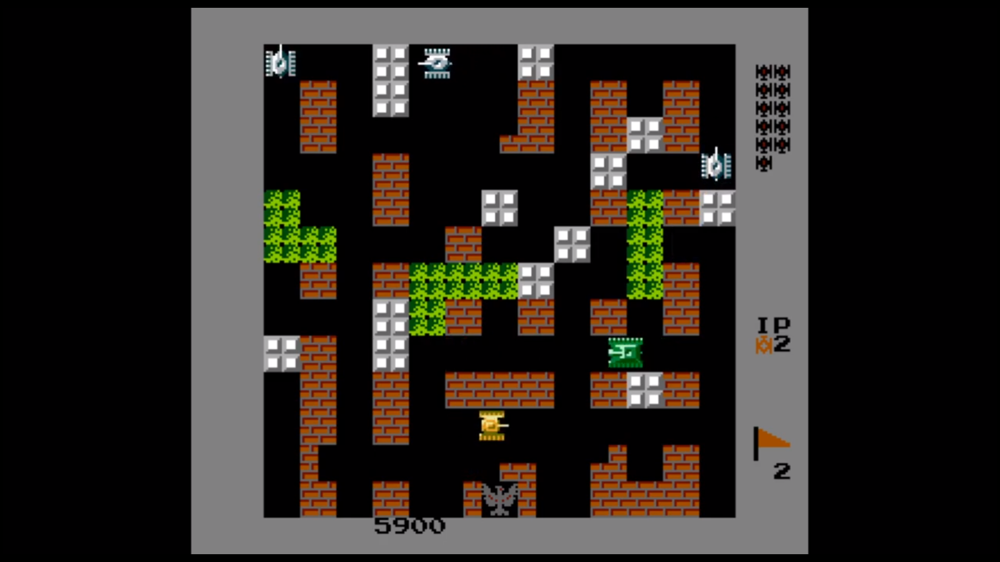

# Germix Games

## Binaries

- libFLAC-8.dll
- libjpeg-9.dll
- libmodplug-1.dll
- libmpg123-0.dll
- libogg-0.dll
- libopus-0.dll
- libopusfile-0.dll
- libpng16-16.dll
- libtiff-5.dll
- libvorbis-0.dll
- libvorbisfile-3.dll
- libwebp-7.dll
- SDL2.dll
- SDL2_image.dll
- SDL2_mixer.dll
- zlib1.dll

## Dependency

- SDL2 2.0.9
- SDL2_image 2.0.4
- SDL2_mixer 2.0.4

## Screenshots

